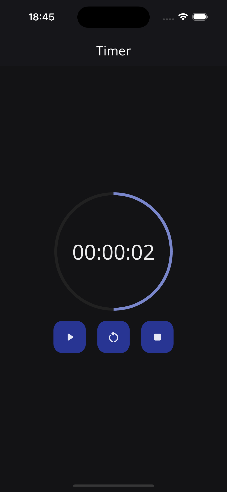

# Timer Flutter

Aplicativo feito com [Flutter](https://flutter.dev/), que tem como funcionamento ser um temporizador. Em que o usuário por meio de um [CupertinoTimerPicker](https://api.flutter.dev/flutter/cupertino/CupertinoTimerPicker-class.html) indica quanto tempo o temporizador vai ter.

## Packages

- [flex_color_scheme](https://pub.dev/packages/flex_color_scheme)
- [equatable](https://pub.dev/packages/equatable)
- [flutter_bloc](https://pub.dev/packages/flutter_bloc)
- [google_fonts](https://pub.dev/packages/google_fonts)
- [gap](https://pub.dev/packages/gap)
- [auto_size_text](https://pub.dev/packages/auto_size_text)

## Como Usar

```shell
- Primeiramente, configure corretamente o ambiente de desenvolvimento Flutter em sua máquina, consulte https://flutter.dev/docs/get-started/install

- Clone este repositório
$ git clone git@github.com:AntonioAndradeGomes/timer_flutter.git

- Entre no diretório
$ cd teste_sciencedex

- Instale as dependências
$ flutter pub get

- Execute um emulador ou conecte a um dispositivo físico, a documentação do Flutter explica como faz a parte do dispositivo físico

- Execute o aplicativo
$ flutter run
```


## Imagens do projeto

1. Estado inicial

Usuário pode selecionar o périodo e iniciar o temporizador.


2. Temporizador executando

Usuário ver o tempo do temporizador sendo reduzido, e pode pausar ou cancelar o temporizador que volta ao estado inicial.
 


3. Temporizador pausado

Usuário ver o tempo do temporizador em pausa, e pode dar continuidade, reiniciar ou cancelar o temporizador que volta ao estado inicial.
 


4. Temporizador finalizado

Usuário ver que tempo do temporizador finalizaou, e pode dar recomeçar ou cancelar o temporizador que volta ao estado inicial.
 
